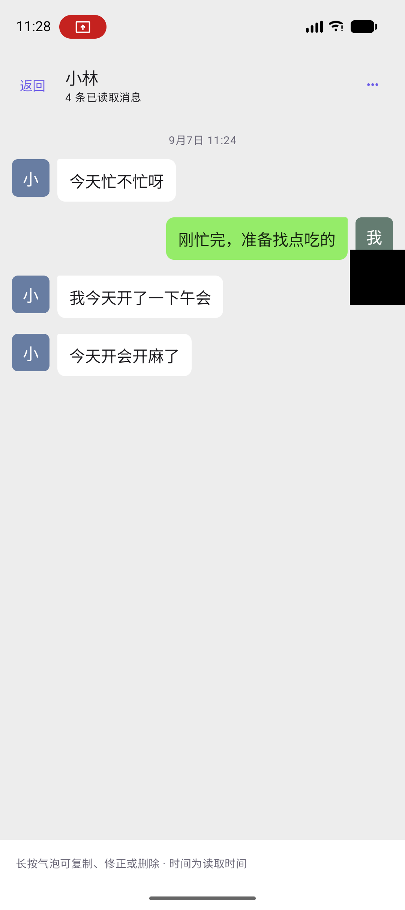
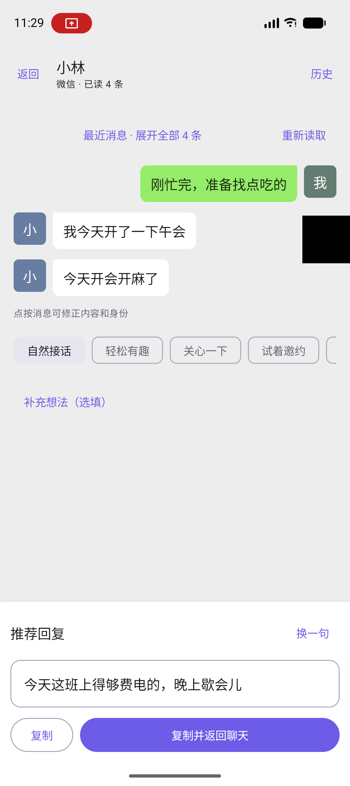

# 聊天交互重构

## 用户流程

打开微信、小红书或抖音的具体聊天 → 点击悬浮助手 → 看到最近三条消息和推荐回复 → 可改语气、修改文字 → 复制并返回原 App。

有不确定身份时展示校正提示。模型未配置时保留上下文，点击生成进入模型设置。对方未回复时不自动追发。生成中可以停止，取消会传播到 OkHttp 请求；未完成的流式内容不会作为完成稿保存。复制的建议不写成“已经发送”的历史。

历史页用灰底、白色来信气泡、绿色己方气泡和头像字母展示。初次打开定位最近消息；时间分隔表示读取时间，不伪装成原 App 的真实发送时间。管理操作收进菜单；消息校正和复制放在气泡长按菜单。列表可搜索联系人/最后一条消息、按 App 筛选。

## 读取与上下文

- 微信、小红书、抖音分别维护输入提示、状态和导航过滤；支持 QQ、Telegram、WhatsApp、短信及未知 App 的通用回退。
- 无障碍只在用户请求时采集可见应用窗口，排除输入法窗口和密码节点。保留输入框/头像几何信息，输入框草稿不进入聊天消息。
- 根据输入框位置确定消息区域，适应键盘弹起；长气泡优先参考外侧边缘和头像。无障碍独立气泡不再合并，OCR 仅合并紧邻、对齐的换行。
- 屏幕读取质量不足时混合模式使用 OCR。OCR 使用实际截图大小，并把无障碍输入框/头像坐标缩放到同一坐标系。
- 无标题、无消息或明显处于信息流/评论区时不给这些内容建立会话。不同名称不再靠一字之差或常见问候合并；备注与识别键分离。
- 同 App 同名联系人仅凭屏幕标题仍无法可靠区分；群成员姓名和富媒体未全面结构化。没有三款 App 的已登录实机数据，因此这些适配属于启发式改进，不能视为逐版本兼容认证。

## 回复策略与参考边界

2026-09-07 检索了 [童锦程聊天录播条目](https://www.bilibili.com/video/BV1zoezzjEzs/) 和 [B 站展示面相关视频页面](https://www.bilibili.com/video/BV1Bd1WYQEFG/)。可访问内容主要是视频标题、简介及关联条目，没有取得完整字幕或逐段观看证据；不把任何具体技巧归因为已验证的“童锦程聊天公式”。

本次落地是产品层面的设计判断：先回应具体内容与情绪，再酌情分享真实细节，匹配双方熟悉程度和互动积极性。减少盘问、说教、模板式共情和硬撩；用户明确邀约时再轻量推进，对方忙或拒绝时允许收尾。展示生活只使用已知事实，不凭空编造身份、经历或照片/视频内容。提示词内示例是自行编写的合成示例。

请求将聊天作为带 speaker 字段的 JSON 数据传入，保留开头的己方发言，避免把历史误作模型自己的指令或丢掉连续发言。用户长期偏好与本次语气共同生效。没有实际调用用户付费模型做质量评测；提示词约束不能保证每个模型都输出理想回复。

建议人工评测的场景：刚认识的破冰、朋友玩笑、下班疲惫、认真提问、明确拒绝、对方忙、未回复、共享视频但不可见、工作群、用户提供真实兴趣后的邀约。每条按接话准确、事实真实、长度合适、关系分寸、可直接发送五项评分；不要把单元测试通过解释成话术效果经过用户验证。

## 验证

专项测试覆盖聊天区域、键盘/草稿、导航/评论区拒绝、长气泡身份、OCR 换行、无障碍重复节点、联系人隔离、备注持久化、编辑历史对齐、JSON 请求及网络取消。

```bash
bash gradlew testDebugUnitTest --tests 'com.hwb.aianswerer.chat.*'
bash gradlew assembleDebug
bash gradlew lint
```

设备测试使用合成消息和设备内的 MockWebServer，不连接用户模型，不读取真实社交账号。隔离安装使用 `.preview` 包名，默认 Debug 包名保持不变。

```bash
bash gradlew connectedDebugAndroidTest -PchatmateDebugSuffix=.preview \
  -Pandroid.testInstrumentationRunnerArguments.class=com.hwb.aianswerer.chat.ChatFlowScreenshotTest
```

设备测试保存截图到模拟器 `/sdcard/Download/chatmate-qa/`。Debug 网络配置只允许 localhost/127.0.0.1 明文测试流量，Release 不包含该配置。本机 Pixel 10 / Android 17 出现已有 ML Kit/MMKV 原生库的 16 KB 兼容性提示，测试关闭该提示后继续；本次未升级这些依赖。

验证结果见下方记录，不能把模拟数据验证视为微信、小红书、抖音真实登录环境的验收。

## 界面截图

以下为模拟器中的合成聊天与本地模拟回复，不是实际用户聊天或线上模型效果证明。

| 历史记录 | 推荐回复 |
| --- | --- |
|  |  |

内部广播现在通过 ContextCompat 在各版本注册为不导出，保持应用内调用；旧版本不再依赖发送方 setPackage 作为接收方保护。修复了首页模型菜单派生状态的重复创建和三个缺失英文文案。Quick Settings 旧 API 分支保留必要的兼容调用并限定说明。

## 中断后续接与 Release 验证（2026-09-07）

- 复核现有读取、回复生成、上下文和历史界面改动，以及保存的合成场景截图；本次按用户要求未运行单元测试或设备测试。
- `git diff --check` 通过。
- `bash gradlew assembleRelease lintRelease --console=plain` 通过，包含 Kotlin/Java 编译、R8 混淆和资源压缩。Lint 为 0 errors、335 warnings，并非零警告。当前机器可用构建 JDK 为 Zulu 21。
- 安装包：`app/build/outputs/apk/release/20260907-1228_ChatMateAI_v1.7.0.apk`，约 35 MB，版本 1.7.0（19）。
- `apksigner verify --verbose --print-certs` 通过（v2）。本地未配置发布签名凭据，现有 Gradle 配置回退到 Android Debug 证书；该包是经过压缩混淆的 Release 构建，但不是正式发布密钥签名。不能覆盖签名不同的已安装版本。
- 三款 App 的真实登录环境兼容性、线上模型的实际话术质量仍需实用反馈验证。
